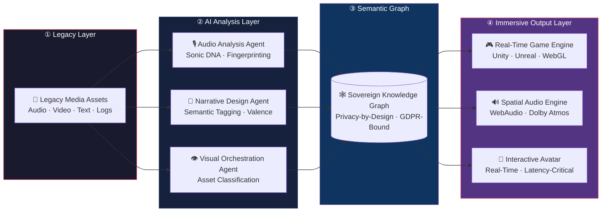

# CAITE — Creative-AI Transformation Engine

> *"The companies that will lead the next decade are not those who adopt AI — they are those who architect it into the DNA of every creative and operational layer."*
> — Matthias Köhler, Managing Director · Oszillation AI Ecosystems

---

## From Status Quo to Immersive Future

Legacy media pipelines were built for a world of linear production: record, post-produce, distribute, repeat. That world is over.

**CAITE** is the sovereign transformation engine that bridges 15+ years of High-Fidelity Audio Engineering and Game-Engine Design with the full power of Agentic AI — without surrendering GDPR compliance, data sovereignty, or architectural control.

This repository is a **living blueprint**. It is not a proof-of-concept. It is a production-grade framework used by Oszillation AI Ecosystems to guide **European media companies, SaaS operators, and Private Equity portfolios** through the complete migration from passive content delivery to **Immersive, Interactive, Sovereign AI Experiences**.

---

## The Intersection: Where Audio Engineering Meets Agentic Intelligence

Traditional AI transformation ignores the *sensory layer*. CAITE does not.

| Domain | Legacy Paradigm | CAITE Paradigm |
|---|---|---|
| **Audio** | Static mix, post-rendered | Spatial, real-time, AI-generated Sonic DNA |
| **Visual** | Pre-recorded, linear | Real-Time Avatar synthesis, latency-critical rendering |
| **Narrative** | Scripted, one-directional | Agent Swarm-driven, context-aware storytelling |
| **Architecture** | Monolith SaaS | Sovereign Agentic Workflows on Zero-Trust infrastructure |
| **Compliance** | Reactive, legal overhead | Privacy-by-design, embedded in the orchestration layer |

The result: **Multimodal Orchestration** at enterprise scale — where every pixel, every sound wave, and every data transaction is governed by sovereign, explainable AI logic.

---

## The Transformation Framework

CAITE operates in four sovereign phases:

### Phase I — Sonic DNA Extraction
Legacy media assets (audio archives, broadcast masters, SaaS interaction logs) are ingested and analyzed by the **Audio-Analysis Agent**. Acoustic fingerprints, semantic patterns, and emotional valence are extracted and encoded into a **Semantic Graph** — the foundational knowledge layer of your immersive future.

### Phase II — Semantic Enrichment & Knowledge Sovereignty
The raw Semantic Graph is enriched through the **Narrative Design Agent** and cross-referenced against your proprietary knowledge base. Zero-Trust data boundaries are enforced at the graph level. No raw data leaves the sovereign perimeter.

### Phase III — Immersive Output Synthesis
The **Visual Orchestration Agent** connects the enriched graph to real-time engines (Unity, Unreal, WebAudio). Interactive Avatars, Spatial Audio scenes, and Adaptive Narrative layers are generated on-demand — latency-critical, production-grade.

### Phase IV — Continuous Sovereign Improvement
Agent Swarms monitor output quality, user interaction, and compliance posture in real time. The Creative Director Agent recalibrates the entire pipeline based on measured outcomes. The system learns. The system improves. The system remains yours.

---

## Innovation Pipeline



---

## Repository Architecture

```
CAITE/
├── transformation-framework/     # Phase I–IV strategy docs & migration logic
│   ├── phase-1-sonic-dna.md
│   ├── phase-2-semantic-enrichment.md
│   ├── phase-3-immersive-synthesis.md
│   └── phase-4-continuous-improvement.md
│
├── multimedia-agents/            # LangGraph agent definitions
│   ├── audio_analysis_agent.py   # Sonic DNA extraction & fingerprinting
│   ├── visual_orchestration_agent.py
│   ├── narrative_design_agent.py
│   └── agent_registry.py        # Sovereign agent registry & capability map
│
├── immersive-interface/          # FastAPI ↔ Real-Time Engine bridge
│   ├── main.py                   # WebSocket gateway
│   ├── audio_stream_handler.py
│   ├── avatar_sync_handler.py
│   └── requirements.txt
│
├── innovation-dashboard/         # C-Level Innovation Cockpit blueprint
│   ├── dashboard_schema.json
│   ├── roi_calculator.py
│   └── README.md
│
├── src/
│   └── orchestrator.py           # Creative Director multi-agent orchestrator
│
├── docs/
│   └── transformation_blueprint.md   # PE/CTO strategy paper
│
└── README.md                     # This document
```

---

## Who This Is For

**Chief Executive Officers** who need to understand why their media infrastructure is a liability — and how sovereign AI converts it into a compounding asset.

**Chief Technology Officers** who need a production-grade architecture that survives regulatory scrutiny, integrates with existing enterprise stacks, and scales without vendor lock-in.

**Private Equity Operators** who need a measurable transformation framework that maps directly to EBITDA improvement, churn reduction, and content monetization velocity.

**Media Executives** who need to future-proof editorial and distribution workflows against AI-native competitors — without dismantling what already works.

---

## Sovereignty Is Not Optional

CAITE is built on a single non-negotiable principle: **your data, your models, your infrastructure**.

- **Zero-Trust Network Architecture** — every agent-to-agent communication is authenticated and audited
- **GDPR-native orchestration** — privacy controls are enforced at the graph layer, not bolted on afterward
- **On-premise & sovereign cloud deployment** — no dependency on US hyperscaler data residency
- **Explainable Agent Decisions** — every creative and technical output is traceable to a decision graph

---

## Development & Architecture

CAITE is developed and maintained by **Oszillation AI Ecosystems**.

**Matthias Köhler** · Managing Director & Principal AI Architect  
GitHub: [@WizardofTryout](https://github.com/WizardofTryout)  
Brand: *The Sonic Architect*

---

*CAITE is a living system. Every commit is a transformation.*
